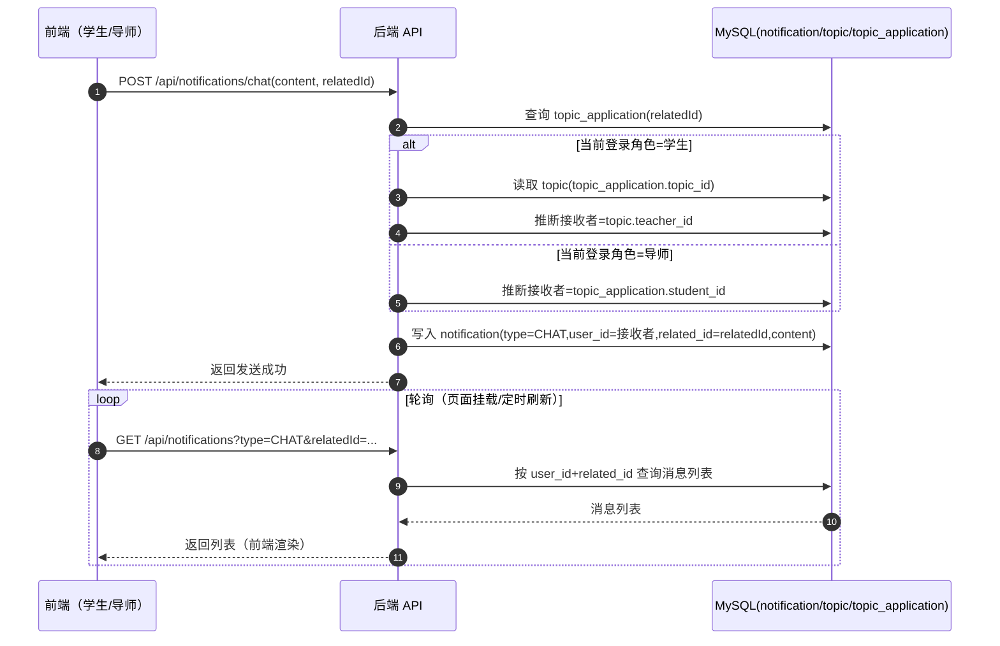
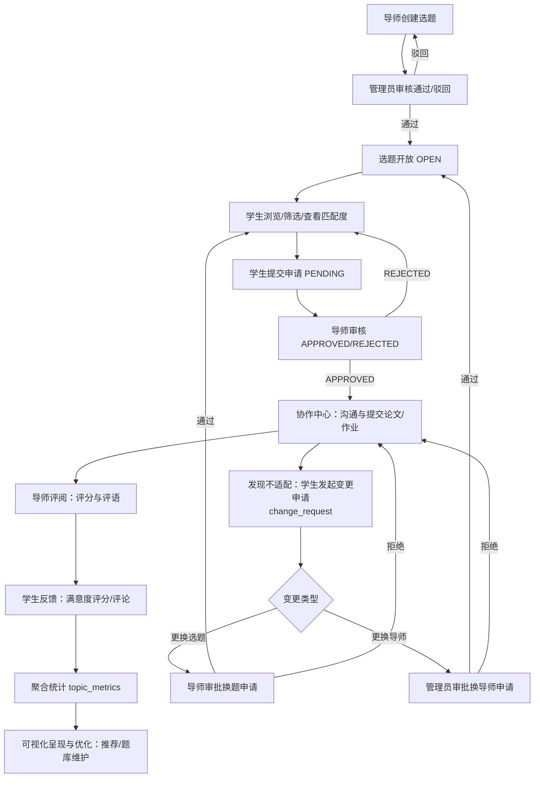
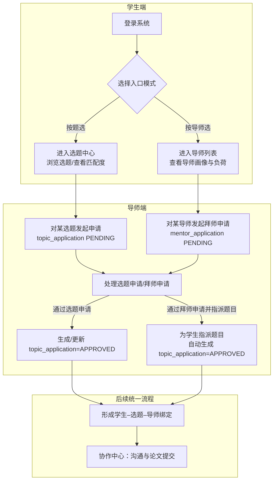
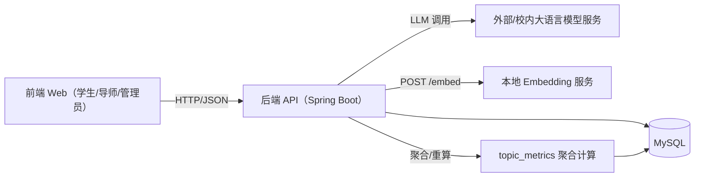

## 四、研究内容与技术实现体系

本研究围绕“标签体系构建—功能落地—算法支撑”三条主线展开，系统性设计并实现毕业论文选题与导师管理系统的核心功能。

### （一）学生与导师标签体系构建

在任何一个试图“智能推荐选题”的系统中，如果底层对学生、导师和选题的描述仍停留在简单的文本字段层面，那么无论算法多么复杂，最终都只能在模糊的信息上做文章，很难给出真正有说服力的匹配结果。因此，本研究将标签体系视为整个系统的“语言”和“坐标系”：只有先回答清楚“我们用什么维度来描述学生、导师和选题”，后续的推荐、生成和评价才有可能建立在坚实的基础之上。围绕这一问题，系统遵循“层级化 + 学科差异化”的原则，分别为学生、导师和选题构建了三套既相互独立又可以对齐的标签集合。

在学生侧，系统并不满足于记录专业、年级等基础信息，而是围绕“发展需求–能力特征–基础信息–资源需求”四个视角，鼓励学生在完善个人资料时尽量讲清楚自己未来是倾向就业、考研还是出国深造，在哪些课程或技能上更有优势，参与过哪些项目实践，以及在完成论文时可能需要哪些实验设备或数据支持。这些看似琐碎的信息，最终都会被抽象和压缩到 `user_tag` 表中，以“标签名称 + 权重”的形式长期保存，并在后续推荐和匹配过程中反复被使用。对于导师而言，系统同样通过标签化的方式刻画其研究领域、指导风格和资源条件，例如将“机器学习”“教育数据挖掘”“金融风险管理”等研究方向，与“指导经验丰富”“偏重实践”“可提供企业实习”等特征一并转化为结构化标签，使得“选哪个导师”不再只是对姓名和职称的选择，而是对一组更丰富特征的综合判断。

选题本身也被视为一个具有多维属性的“对象”，而不是一段孤立的标题和简介。系统在设计 `topic` 相关字段时，就考虑到需要在标签空间内为每个选题预留“需求适配、能力要求、资源保障和导师关联”等维度：例如，一个依托真实企业项目的课题会在资源维度上标记“需要企业数据”“需要企业导师参与”，而一个偏理论研究的课题则可能在能力维度上强调“需要较强的数学推导能力”。通过这种方式，学生、导师和选题三者虽然在数据库中分属不同表，但在标签空间内却拥有可以直接对齐的坐标，从而为后续的匹配度计算和推荐排序提供了统一的“语境”。

在具体实现上，系统后端通过 `UserTag` 实体与标签管理服务，将上述逻辑固化为一套可运营的机制。每当学生更新兴趣描述或导师调整研究方向时，标签服务会综合使用简单规则、关键词抽取以及可选的 AI 标签抽取，对文本进行再加工，生成一批新的标签候选，并在去重和权重合并之后写入 `user_tag` 表。前端则通过精心设计的个人资料与兴趣填写界面，引导学生和导师以尽可能自然的方式完成信息补充，而不需要直接面对“标签”这一抽象概念。可以说，标签体系既是系统内部算法的“原材料”，也是把复杂教育场景压缩进信息系统的一种折中表达。

### （二）学生标签化选题推荐方法

在标签体系搭建完成之后，如何把这些标签真正用起来，为学生给出有意义的选题建议，就成为系统设计中的下一个核心问题。单纯按照“成绩高的学生优先选择热门导师”或“谁先点谁先得”的规则，虽然在操作上简单，但既忽略了学生个体在兴趣和能力上的差异，也没有充分利用前文构建的丰富标签信息。本研究希望通过一种标签化的推荐方法，让系统在学生打开选题列表的那一刻，就能够给出一个大致合理的排序结果：那些在方向、能力要求和资源条件上与学生更为契合的题目，会自然排在更靠前的位置，而明显不适配的题目则被“温和地”放在列表靠后，作为扩展选择保留一定多样性。

在理想状态下，这样的推荐过程可以被表述为一个多维特征向量之间相似度计算的问题：学生和选题分别被映射到同一维度的向量空间中，系统在需求、能力和资源等子空间内分别计算它们之间的相似度，再按照一定权重将这些子结果融合为一个总匹配度分数。这一思路在推荐系统领域已经较为成熟[3-4]，其工程实现常借助向量空间表示与余弦相似度等度量方法[5,22]。然而，毕业论文选题场景与电商或视频推荐不同，它对可解释性和实现成本的要求都更为严格：导师需要“看得懂、说得清”为何某个学生与某个题目被评为高匹配度，系统也需要在有限资源下支撑整个学院甚至全校的并发访问。

基于此，本文在总体上沿用了“标签向量相似度”的思想，但在具体实现时选择了一条更为务实的路径：将复杂的多维相似度模型拆解为若干可以逐步引入的子模块。在系统当前版本中，首先落地的是一个基于标签重合度的匹配算法，它关注的是“学生拥有哪些高权重标签，这些标签在选题标题和描述中是否有足够多的出现”，并将这一重合度映射为 0.30–1.00 之间的匹配分数，作为导师审核时的直观参考；相关设计与实现细节在后文“（六）基于标签重合度的选题匹配算法设计与实现”一节中有更为详尽的展开。随着系统运行时间的增加和数据的积累，这一基础算法可以被逐步替换或叠加为更复杂的向量相似度模型，而不需要推翻现有的数据结构和前端交互设计。

在推荐结果呈现上，系统也刻意避免给学生一种“被算法支配”的感觉。学生在“选题中心”看到的仍然是一份普通的选题列表，只是默认排序会综合考虑匹配度、导师负荷和选题状态等因素；如果学生有明确的个人偏好，也可以按照发布时间、导师姓名或自定义筛选条件重新排序。这样做的出发点，是希望在“算法辅助决策”和“学生自主选择”之间取得平衡：系统负责把那些更可能合适的选题推到学生面前，但最终的选择权仍然牢牢交到学生自己手中。

### （三）导师 AI 选题生成与去重机制

在传统毕业论文管理中，导师往往需要在短时间内为多名学生设计题目，既要考虑教学大纲和培养方案，又要兼顾自身研究方向与项目进度。很多老师会在往届题目基础上略作修改或“翻新”，时间久了难免出现选题老旧、与最新学科前沿脱节，甚至同一题目被多届学生反复使用的情况。与此同时，一些年轻导师或新进教师可能拥有大量新颖想法，却苦于没有足够时间将这些想法细化为可操作的题目描述和任务拆分。如何在不增加导师额外负担的前提下，让题库保持一定的新鲜度和多样性，成为本系统设计中的另一项关键诉求。

大语言模型的出现为这一问题提供了一种全新的可能：如果可以把导师的研究方向、教学要求以及对题目难度和形式的偏好，以一种机器可理解的方式提供给模型，让其在这些约束下自动生成若干候选选题，再由导师进行甄别和调整，那么命题这一原本高度依赖个人精力的工作，就有望转变为“人机协同”的过程[7-8]。基于这一设想，系统在后端实现了一个围绕 `AiTagService` 展开的选题生成机制：当导师在界面上勾选或填写自己的研究方向、目标学生层次和希望覆盖的知识点后，这些信息会被转换为结构化的提示词模板，并在其中加入学校或学院层面对选题形式和难度的基本规范，最终组装成一段适合提交给大语言模型的请求内容。

模型返回的并不是一两句话的“灵感提示”，而是一批包含“题目名称、研究背景、主要内容、能力要求和数据或资源需求”等要素的候选选题草案。系统会首先对这些草案做一次自动筛查：一方面，将其重新映射为标签集合，与导师自身标签进行匹配，过滤掉明显偏离导师研究方向的题目；另一方面，将生成结果与现有题库进行相似度比对，避免简单的语句重写或主题微调在数据库中反复出现。这里的去重过程综合利用了两类信息：一是结构化标签之间的集合相似度（可用杰卡德相似度衡量[6]），二是题目文本及简要描述之间的语义相似度（可用余弦相似度或向量检索方法近似计算[5,22]），从而在“看得见的关键词”和“背后的语义内容”两个层面共同控制选题的同质化风险；当题库规模进一步增大时，也可以引入 MinHash 等近似去重方法以降低近重复检测的计算成本[21]。

经过这一轮“机器自检”之后，保留下来的候选题目才会出现在导师的选题管理界面中，供其逐条查看和编辑。导师可以根据自己的教学计划和学术判断，对题目进行重命名、删减或补充说明，也可以直接删除不合适的条目，仅将少数真正认可的选题一键入库。整个流程避免了“大模型直接决定题库内容”的风险，而是让 AI 退居为“生成助手”和“备选方案提供者”，最终的学术和教学责任仍然由导师本人承担。这种设计既充分利用了大模型在文本生成和拓展思路上的优势，又通过标签匹配、去重算法和人工审核三道“闸门”，将其潜在的不确定性控制在可接受范围之内。

### （四）选题反馈与双模式选题流程

在很多学校的实践中，毕业论文选题一旦完成备案，后续的调整空间就非常有限。学生如果在开题甚至写作过程中发现题目与自身能力或发展规划不符，往往需要在“硬着头皮做完”和“冒着时间成本重新走流程”之间做出艰难选择。与此同时，学校在管理层面也缺乏一个能够系统性汇集学生反馈和选题运行情况的机制，很难从数据上回答“哪些选题经常被学生评价为难度过高或资源不足”“哪些导师的题目长期表现稳定”等问题。本研究在设计系统业务流程时，希望通过“选题反馈 + 双模式选题”的组合，既为学生保留适度的调整通道，也为学校构建起一条贯穿整个选题生命周期的过程数据链。

在具体实现上，系统并没有把“返工”停留在概念层面，而是落地了一条完整的**选题/导师变更申请工作流**。学生在“协作中心”页面看到当前已确认的选题和导师信息时，如果确实觉得不合适，可以直接点击“申请更换选题”或“申请更换导师”按钮，填写简短的原因说明后提交。后台会在 `change_request` 表中记录一条新的变更申请，关联当前有效的 `topic_application` 记录，并区分变更类型是调换题目还是调整导师。系统在流程上将两类变更做了差异化分流：**更换选题由导师审批**，**更换导师由管理员审批**；在审批通过前，系统不会立刻“抹掉”原有绑定关系，而是将其标记为待处理状态，等待后续结论。审批结果会通过通知中心即时反馈给学生，整个过程有迹可循，也避免了私下沟通带来的信息不对称[24-25]。

对于“更换选题”这一类请求，系统采取“导师主导、学生重新选题”的策略。导师端单独提供了“变更申请”页面，按列表的形式展现名下所有待处理的换题申请，包括学生姓名、当前选题标题以及学生填写的原因说明。导师可以在理解学生具体困难之后，选择同意或拒绝这次变更：在当前实现中，同意将**解除当前绑定关系**（将对应 `topic_application.status` 更新为 `REJECTED` 并回收选题名额），学生端随之不再显示原来的协作关系，可回到选题中心重新选题；拒绝则维持原绑定不变，并将拒绝意见推送给学生。

“更换导师”的申请则由管理员从全局角度统筹。管理员端新增了“导师负荷与变更”模块，一侧汇总展示每位导师当前的学生数量、最大可带学生数以及开放选题数量等负荷指标，另一侧列出所有待处理的“更换导师”申请。管理员在查看学生的原因说明以及原导师负荷状况后，可以决定是否解除当前导师–学生–选题三方的绑定关系：在当前实现中，同意将**解除当前绑定关系**（同样将对应 `topic_application.status` 更新为 `REJECTED` 并回收名额），使该学生回到“未绑定”状态，再由学生按照正常流程重新选择导师和题目；拒绝则维持原绑定不变，并将意见通知学生。这样一来，“是否更换导师”的决策就不再是个别沟通的结果，而是纳入了学院层面对导师负荷和整体资源平衡的考量。

在选题模式设计上，系统并没有强行规定“所有学生都按同一条流水线走完”，而是刻意保留了两条入口路径。一条是前文已经详细介绍的“先选题再匹配导师”：学生围绕具体题目发起申请，由对应导师审核，通过后自然形成“学生–选题–导师”三方绑定。另一条则是“先选导师再由导师下放题目”：系统单独提供了一个**导师列表**页面（学生端路由为 `/student/teachers`），把每位老师的研究方向、职称、当前带生数量与最大可带学生数、开放选题数量以及代表性选题标签等关键信息集中展示；同时从 `topic_metrics` 与论文评价数据中汇总出每位导师的历史评价概览（如平均成绩、优秀率、不及格率等），以摘要形式呈现，便于学生结合自身意向与导师负荷情况做选择。学生可按姓名、研究方向或标签进行筛选。若更看重某位导师的研究方向或发展资源，可在该页面点击“申请成为该导师学员”，在弹窗中填写期望方向、个人背景与学习计划等说明后提交**拜师申请**。

系统为“拜师申请”单独建立了 `mentor_application` 表，用于表示“学生–导师意向绑定”：每条记录包含 `student_id`、`teacher_id`、`status`（PENDING / APPROVED / REJECTED / CANCELLED）、学生填写的 `reason` 以及导师审批时的 `teacher_comment`。学生提交后，导师在各自的**拜师申请处理**页面（导师端路由为 `/teacher/mentor-applications`）看到待处理列表，可对每条申请选择“同意”或“拒绝”，并可选填审批意见；同意后，导师从本人名下的题库中为该学生选择一道已开放题目，通过“为其指派课题”操作提交，系统在事务中校验该学生尚无其他已通过的选题申请后，自动插入一条 `topic_application` 记录并置 `status = APPROVED`，同时更新对应选题的当前申请人数。若导师希望为该生单独拟题，可先在“选题管理”中新建题目并提交审核，待题目开放后再回到拜师申请页面完成指派。这样，两种模式在体验上有所区分，但在数据层面最终都统一折叠为同一种“选题申请 + 选题实体”的绑定结构，后续的协作中心、消息沟通、论文提交与评价等流程完全沿用既有逻辑，方便协作管理和质量统计。如果学校需要从管理视角审视不同模式的效果，后台的统计模块也可对两类入口下产生的申请数据统一建模和汇总，从而在不打乱既有审核制度的前提下，比较灵活地支持多样化的选题路径。

### （五）选题发布—协作—评价的业务闭环

上述各功能最终汇聚成一条“从选题发布到质量评价”的完整业务链路，既回答“**如何解决当前选题管理的问题**”，也为后续智能推荐与管理决策提供数据基础。整体流程可以概括为八个环节（并包含一条可选的“变更/返工”支路）：

1. **选题发布与审核**
  导师在“选题管理”模块创建选题，填写标题、描述、最大人数及标签，系统将记录写入 `topic` 表。选题通过管理员审核后状态变为 `OPEN`，对学生开放。
2. **学生浏览与提交申请**
  学生在“选题中心”中浏览开放选题，结合推荐结果和个人意向选择若干课题，并通过界面提交申请。系统在 `topic_application` 中写入 `PENDING` 状态的申请记录，同时可触发通知提醒导师有新申请。
3. **导师审核申请并确定师生绑定关系**
  导师在“申请处理”模块按选题查看所有申请，结合系统给出的匹配度与学生备注做出“通过 / 拒绝”的决定：  
  - 通过：`topic_application.status = APPROVED`（即申请记录的 `status` 字段值为 APPROVED，表示该申请已被导师正式通过），视为学生–选题–导师正式绑定；  
  - 拒绝：状态设为 `REJECTED`（表示该申请被导师拒绝），可在记录中写入反馈意见。  
   这一绑定关系就是后续协作、作业提交和评价的唯一锚点。
4. **确认选题后的协作与作业提交**
  对于已通过的申请，学生和导师都可以在“协作中心”中看到相同的选题信息。学生在该模块中上传作业或论文文件，系统在 `thesis` 表中新增或更新记录，并通过 `notification` 创建 `THESIS_UPLOADED` 通知（即 `type` 字段为 `THESIS_UPLOADED` 的系统消息，表示“论文已上传”）提醒导师查看，实现从“选题”到“论文”的自然过渡。
5. **过程中的消息沟通与指导反馈**
  在同一协作界面，学生和导师可以通过对话框互发消息。系统将每条消息作为一条 `notification` 记录保存，其中 `type = CHAT`（`type` 字段值为 CHAT，表示这是聊天消息），`related_id` 绑定到对应的 `topic_application.id`（`related_id` 字段用于指明这条消息隶属于哪一次选题申请）。  
  从技术角度看，系统采用“数据库收件箱 + HTTP 轮询”的轻量级消息中转方式，并将“谁发给谁”的关系托管给选题申请与选题实体（基于标准 HTTP 语义进行请求/响应交互[17]）。其核心路由逻辑可概括如下（与实现保持一致）：

  在该设计下，“会话锚点”统一使用 `topic_application.id`，消息路由依据为 `topic.teacher_id` 与 `topic_application.student_id` 的组合，因此当发生“更换导师”等场景时，只需更新选题/申请关系即可实现消息接收方的平滑迁移。
6. **导师评阅与成绩录入（教师侧评价）**
  学生完成论文后，导师在协作中心的论文列表中为每篇论文录入评分和评语，包括论文总分、答辩成绩、评阅成绩和等级等。系统在 `thesis_evaluation` 表中为该 `thesis_id` 生成或更新一条评价记录，同时将 `thesis.status` 标记为 `REVIEWED`（即 `status` 字段值为 REVIEWED，表示该论文已完成评审）。后台服务再基于这些评价数据，按 `topic_id` 聚合计算出每个选题的平均成绩、优秀率、不及格率等指标，写入 `topic_metrics`（存放选题质量统计数据的汇总表），为后续可视化与决策提供原始数据。
7. **学生视角的满意度反馈（学生侧评价）**
  在导师评分之后，学生可以对本篇论文和导师指导情况进行一次主观评价，给出 0–100 的总评分并填写简短评论。系统将这部分信息同样写入 `thesis_evaluation`（`student_score` 字段表示学生给出的分数，`student_comment` 字段记录学生的文字评价），从而在同一条记录中同时保留“教师评价”和“学生满意度”两种视角，实现真正意义上的双向反馈。
8. **数据闭环与可视化呈现**
  系统定期或在评价更新时重新计算 `topic_metrics`，并在导师端的“选题质量”页面和管理员端的“选题质量分析”页面，用柱状图、折线图和扇形图等可视化方式展示：  
  - 各选题的平均成绩与优秀率、不及格率；  
  - 学生评分的平均值及满意/不满意比例；  
  - 不同选题、不同导师的质量对比。  
   这些指标一方面反哺智能推荐与题库维护（优先推荐表现稳定的选题，预警长期表现不佳的题目），另一方面也为学院和学校层面的课程设置、导师选题优化与教学质量评估提供了量化支撑，从而形成“**发布–申请–协作–评价–优化**”的完整闭环。

> **可选支路：选题/导师变更（返工机制）**  
> 在协作过程中，学生可发起“更换选题/更换导师”变更申请。系统将申请写入 `change_request` 并进入待处理队列：更换选题由导师审批、更换导师由管理员审批；审批通过时解除当前绑定并回收名额，学生回到“未绑定”状态后重新选题/选导师，审批拒绝则维持原绑定不变。该支路为高风险/不适配选题提供受控的调整通道[24-25]。

为便于读者整体把握业务闭环，本文进一步将上述 8 个环节归纳为如下流程图（对应关系与前述文字一一一致）。

> 为更直观地呈现“先选题再匹配导师 / 先选导师再下放题目”两种模式在同一数据结构下的统一入口，本文给出如下简化流程图。

### （六）基于标签重合度与语义向量融合的选题匹配算法设计与实现

在前文中，系统围绕“学生–导师–选题”三维标签空间构建了选题推荐的总体思路。为了让这一思路真正落地到业务数据中，同时又能在“可解释性”和“语义鲁棒性”之间取得平衡，本文在系统实现阶段将匹配算法设计为一个**可分层、可降级的融合模型**：底层以标签重合度提供清晰可解释的基础分数，在此之上引入由本地部署的 sentence-transformers / BGE 等句向量模型生成的文本语义向量相似度[9-10,13]，最终形成一个既“说得清楚”、又能更好应对同义改写与表达差异的综合匹配度，用于学生提交选题申请时自动计算其与目标选题之间的匹配度，并作为导师审核的重要参考指标。

#### 1. 设计目标与约束条件

在具体实现时，本文并未将“直接上复杂深度模型”作为优先选项，而是从高校教务系统的上线现实出发，将目标收敛到三个关键词：**可解释、可控、可演进**。一方面，导师与学生需要能理解分数背后的依据，系统不能只给出难以说明的黑盒结论；另一方面，匹配计算必须嵌入到高并发的申请流程中，语义向量的引入不能把系统绑死在不稳定的外部依赖上，因此必须具备超时与降级能力；最后，算法升级不应推翻既有数据结构与前端交互，而应保持 `topic_application.match_score` 作为统一落库口径，通过“接口不变、内部增强”的方式逐步从标签模型过渡到语义向量融合，并为后续的向量检索召回、分类型标签权重调整与质量反馈因子融合预留扩展空间。

基于上述考虑，本文将匹配度计算拆分为两个子分数并做融合：首先实现一个**基于标签权重叠加的重合度评分模型**作为稳定、可解释的主力分数；同时引入一个**基于语义向量余弦相似度**的补充分数，以提高对同义表达和文本改写的鲁棒性。两者最终通过线性加权融合并统一映射到 \([0.30, 1.00]\) 区间对外展示与落库。

#### 2. 输入与输出形式定义

从数据结构角度看，融合模型仍然以“学生标签集合 + 选题文本”为核心输入。学生侧的基础信息来自 `user_tag` 表，其形式可以写作 \(T_s=\{(tag_i,w_i)\}\)：其中 \(tag_i\) 是标签名称（如“机器学习”“大数据分析”），\(w_i\in(0,1]\) 是对应权重。选题侧则以 `topic.title` 与 `topic.description` 拼接得到文本 \(D\)，作为规则层命中判断的依据。为了让语义层在工程上更轻量、更稳定，系统并不直接对冗长的画像字段全文编码，而是从学生标签中选取若干高权重项，拼接成一段较短的“语义摘要” \(S\)，与选题文本 \(D\) 一同进入 embedding 编码流程，使向量表示既能覆盖核心方向，又避免噪声文本放大误差。

匹配算法的输出仍然是一个介于 **0.30–1.00** 之间的小数：

\(score \in [0.30, 1.00]\)

其中数值越高，表示该学生标签与选题文本越“契合”。之所以不让分数低于 0.30，是为了避免给学生造成“0 分、10 分”这类极端低分带来的心理压力，同时从产品体验上保留一定弹性空间。

#### 3. 融合匹配度计算过程

融合匹配的计算以同一条申请为单位完成。系统首先构建选题文本 \(D=\mathrm{lower}(title + " " + description)\)，并做简单归一化处理（如转小写、空值兜底），以保证规则层的命中判断稳定可复现。在此基础上，标签层分数 \(score_{tag}\) 通过“命中权重占总权重比例”得到。设学生标签集合为 \(T_s=\{(tag_i,w_i)\}_{i=1}^{n}\)，其中 \(w_i\in(0,1]\)。系统遍历该集合，累计总权重
\[
totalWeight=\sum_{i=1}^{n} w_i,
\]
并对每个标签判断其是否在选题文本中命中（可理解为子串出现），将命中项权重累计为
\[
matchedWeight=\sum_{i=1}^{n}\mathbb{I}(tag_i\subseteq D)\cdot w_i,
\]
由此得到
\[
score_{tag}=\frac{matchedWeight}{totalWeight},
\]
并将其约束在 \([0,1]\) 区间。语义层分数 \(score_{sem}\) 则由本地 embedding 服务编码得到：系统将学生语义摘要 \(S\) 与选题文本 \(D\) 分别编码为归一化向量 \(\vec{s}\) 与 \(\vec{d}\)，再以余弦相似度衡量它们的语义接近程度，
\[
score_{sem}=\cos(\vec{s},\vec{d})=\frac{\vec{s}\cdot\vec{d}}{\left\lVert\vec{s}\right\rVert\left\lVert\vec{d}\right\rVert},
\]
并将结果裁剪到 \([0,1]\) 以便与标签层对齐。由于语义层依赖模型服务，系统在工程上引入了可控的超时与降级逻辑：当 embedding 服务不可达、超时或返回为空时，本次计算会自动回退到标签层分数（或使用中性默认值）以保障主业务流的连续性。最终分数在 \([0,1]\) 空间内做线性融合
\[
raw=\alpha\cdot score_{tag}+(1-\alpha)\cdot score_{sem},
\]
并映射到产品展示使用的 \([0.30,1.00]\) 区间
\[
score=0.30+0.70\cdot raw,
\]
再按两位小数落库与展示。

当学生没有任何标签（例如尚未完善个人资料）或总权重为 0 时，系统会直接返回一个中等匹配度（如 0.50）。这一设计符合“信息缺失=不做强判断”的原则：在缺少足够特征时不对学生做强烈排序偏置，同时也避免因数据不全而“误伤”学生。

#### 4. 与系统数据结构的结合方式

从系统实现角度看，该融合算法被封装为后端统一的匹配服务，并作为“提交选题申请”流程的一部分被调用：当学生提交申请时，服务层读取 `topic` 的标题与描述构造 \(D\)，同时从 `user_tag` 取出标签集合构造 \(S\)，计算得到融合后的匹配分数并写入 `topic_application.match_score`，与申请记录在同一次事务中落库。这样的集成方式避免了在数据库层新增冗余字段，也使导师端可以继续沿用 `match_score` 进行排序与筛选；而语义层的降级策略则保证了在模型服务波动时，申请流程仍能以标签层分数稳定运行。

之后，在导师的申请列表界面中，系统会默认按 `match_score` 从高到低排序，使导师可以**优先看到那些与其选题要求更为契合的学生**。如果导师不希望使用该排序方式，也可以手动切换为按申请时间排序，系统在交互层面保持足够灵活。

#### 5. 可解释性与后续优化空间

尽管融合模型的形式并不复杂，但它在“解释—效果—稳定性”三者之间提供了一种更贴近教务场景的平衡：标签层仍然是可解释性的主要来源；语义层则补足了关键词命中对表达方式过敏的问题。随着运行数据沉淀，未来可以进一步将语义层从“逐对计算相似度”演进为“预计算向量 + 向量检索召回”的两阶段结构；大规模向量相似检索在工程上可参考 FAISS 等研究与开源实现[19]。同时，句向量与语义匹配能力的底层模型通常建立在 Transformer 架构之上[20]，为后续引入更强的语义表示能力提供理论依据。

## 五、关键技术与系统架构

### 5.1 系统总体架构与核心技术

从工程实现角度看，本系统整体采用前后端分离的 Web 架构，接口风格遵循 REST 约束以保持资源建模与交互语义的一致性[14]。为提升可读性，本文将关键技术要素归纳如表 5-1 所示。

| 层次/模块 | 关键技术选型 | 主要作用 |
| --- | --- | --- |
| 前端 | Vue 3 + TypeScript + Element Plus + Pinia | 实现学生/导师/管理员三端界面与状态管理 |
| 后端 | Spring Boot + MyBatis-Plus | 提供业务 API、封装数据访问与事务 |
| 认证与权限 | JWT[12] + Spring Security + RBAC 思路[15] | 无状态身份认证与按角色的访问控制 |
| 数据存储 | MySQL | 业务数据与过程记录存储（申请、论文、通知、评价等） |
| AI/向量能力 | `AiTagService` + `EmbeddingService`（本地向量服务） | 标签抽取、选题生成、语义向量相似度计算[9-10,13,20] |
| 部署 | Docker + docker-compose | 容器化打包与一键部署，提高环境一致性[16] |

系统组件关系可概括为图 5-1（省略部分非关键组件）。

在这一总体架构下，后端按典型分层架构组织（表现层/业务层/数据访问层），以降低耦合并提升可演进性；相关分层与质量属性（如可维护性、可扩展性）分析可参考软件架构领域的通用方法论[23]。各层职责可进一步规整为表 5-2。

| 层次 | 代表组件 | 职责边界 |
| --- | --- | --- |
| Controller | 各类 REST API 控制器 | 参数校验、鉴权结果承接、返回格式统一 |
| Service | `UserService`、`ApplicationService`、`TagService`、`EvaluationService` 等 | 跨表业务编排、事务一致性、领域规则实现 |
| Mapper/DAO | MyBatis-Plus Mapper | 单表 CRUD、查询封装 |

安全与权限控制方面，系统基于 Spring Security 与 JWT 构建了轻量级认证授权机制。用户在登录成功后，由后端签发包含 `userId` 与 `role` 等关键信息的 JWT 令牌（其规范定义见 RFC 7519[12]，安全部署建议可参考 RFC 8725[18]），前端将其存储在本地并在后续请求中附加到 HTTP 头部；后端通过过滤器解析令牌，将当前用户信息注入请求上下文，并按 RBAC 模型思想对路径与角色进行访问控制[15]。例如，`/api/admin/`** 只对管理员角色开放，`/api/teacher/`** 仅供导师使用，而学生端接口则限定在 `STUDENT` 角色之内。对跨域预检请求（OPTIONS 方法）的统一放行，避免了浏览器在发送实际请求前因预检失败而误报“无权限”的问题。通过这种方式，系统在不引入复杂单点登录或网关的情况下，实现了对三类角色的基本隔离和保护。

在标签抽取与 AI 调用方面，系统通过统一的 `AiTagService` 与配置化的 `AiTagProperties` 对外部模型服务进行封装。无论底层使用的是哪一家厂商提供的大语言模型，应用层只需将“待分析文本”和“期望标签数量”等参数传入 `AiTagService`，由其负责按照 OpenAI 风格的 Chat Completions 协议构造请求、处理响应，并对返回的原始文本结果进行解析，抽取出结构化的标签名称列表。这样一来，未来如果学校希望更换模型供应商，甚至在校内自建模型服务，只需要在配置中修改 API 地址和密钥，或者在 `AiTagService` 内部增加适配分支，而不必在多个业务模块中到处修改调用逻辑，从架构层面增强了系统面对外部变化的弹性。

在语义匹配与向量化能力方面，系统将文本 embedding 能力进一步抽象为独立的 `EmbeddingService`，并将其部署形态定位为“校内可控、接口稳定”的基础能力：推荐在本地以 sentence-transformers / BGE 等句向量模型提供一个轻量的 HTTP 向量服务，对外暴露 `POST /embed` 接口，以便后端在需要时完成向量编码[9-10,13]。匹配服务计算 `match_score` 时，会对学生侧的语义摘要与选题文本分别生成归一化向量，并以余弦相似度刻画语义接近程度，使匹配不再完全依赖字面关键词[5]。与此同时，embedding 能力与选题申请主流程之间保持松耦合关系：服务层对向量调用设置超时与异常兜底，当模型服务暂不可用时，系统可自动退回到标签层分数完成本次计算，从而在引入语义能力的同时维持业务的稳定性与可用性。随着数据规模增长，语义层还可以进一步演化为“预计算向量 + 向量检索召回”的两阶段结构，在不改变业务接口口径的情况下提升性能与推荐体验。

### 5.2 数据库设计与主要表结构

系统在 MySQL 中建立的表及其大致用途如下表所示。

| 表名                   | 大致内容                                                                    |
| -------------------- | ----------------------------------------------------------------------- |
| `user`               | 用户表：账号、密码哈希、真实姓名、角色（学生/导师/管理员）、启用状态等统一身份信息。                             |
| `student_profile`    | 学生信息表：专业、年级、兴趣描述等扩展信息，与 `user` 一对一关联。                                   |
| `teacher_profile`    | 导师信息表：职称、研究方向、最大可带学生数等，与 `user` 一对一关联。                                  |
| `tag`                | 标签字典表：系统级标签名称及类型（导师/学生/选题），供标签体系引用。                                     |
| `user_tag`           | 用户标签关联表：用户与标签的多对多关系，含标签名与权重，用于学生/导师画像与推荐。                               |
| `topic`              | 选题表：导师发布的题目标题、描述、状态（草稿/待审核/开放/关闭等）、人数上限与当前申请数。                          |
| `topic_tag`          | 选题标签关联表：选题与标签的关联及权重，用于选题与用户画像的匹配。                                       |
| `topic_review`       | 选题审核记录表：管理员对选题的审核结果（通过/驳回）及审核意见。                                        |
| `topic_application`  | 选题申请表：学生对某选题的申请记录，含状态、学生备注、导师反馈、匹配度等；通过后形成学生–选题–导师绑定。                   |
| `thesis`             | 论文表：学生上传的论文或阶段性作业的文件路径、文件名、大小及上传/已评审状态。                                 |
| `thesis_evaluation`  | 论文评价表：导师评分、答辩与评阅成绩、等级与评语，以及学生满意度评分与评论等闭环评价数据。                           |
| `topic_metrics`      | 选题质量统计表：按选题聚合的平均分、优秀率、不及格率等，用于可视化与决策。                                   |
| `notification`       | 通知表：系统通知与聊天消息，含类型、标题、内容、已读状态及关联对象 ID。                                   |
| `change_request`     | 选题/导师变更申请表：学生发起的更换选题或更换导师申请，含变更类型、审批状态及导师/管理员意见。                        |
| `mentor_application` | 导师申请表：学生“先选导师”意向（学生–导师、申请说明、状态），导师同意后可据此为学生指派题目并生成 `topic_application`。 |

以下按业务域对上述表的设计思路略作展开。

为了支撑“学生–导师–选题–过程管理”的完整链路，系统在 MySQL 中围绕少数几类核心概念进行了数据建模，力求在保持结构清晰的前提下覆盖从账号管理到协作评价的主要业务。最基础的是 `user` 表，它承担着全系统“入口”的角色，所有学生、导师和管理员账号都在这里完成统一管理：每条记录除了包含 `username`、`password_hash`、`real_name` 等通用字段外，还通过 `role` 字段标明用户身份类型，并用 `status` 控制账号启用或禁用状态。后续与个人资料、选题申请、论文提交等相关的业务表，都通过 `user_id` 与这一张基础表建立外键关联，从而保证在账号被禁用或删除时，相关业务数据能够被安全地追踪和处理。

在用户基础信息之上，系统通过 `student_profile` 和 `teacher_profile` 两张扩展表承载“更像人”的那一部分内容。前者存放学生的专业、年级、兴趣描述等信息，后者记录导师的职称、研究方向以及最大可带学生数等约束条件。这些表中的文本字段既直接用于前端的资料展示，也是标签生成服务的重要数据来源：当学生更新兴趣描述或导师调整研究方向时，标签服务会从这两张表中抽取信息，生成或更新对应的 `UserTag` 记录，使得底层标签空间能够随人的状态变化而演化。

围绕选题与申请，系统以 `topic` 和 `topic_application` 两张表构建起“从题目到绑定关系”的主干路径。`topic` 表记录了导师发布的每一个选题，包括题目名称、详细描述、当前状态等信息；`topic_application` 则作为学生对某一选题发起申请时的“事件载体”，既保存学生、选题和导师之间的关联关系，也记录申请状态、学生备注、导师反馈以及系统计算出的 `match_score`（匹配度）等关键字段。当某条申请的 `status` 字段被更新为 `APPROVED` 时，就意味着对应的学生–选题–导师三元关系已经正式确立，后续所有协作、作业提交和评价操作都会围绕这条记录展开。

标签表 `user_tag` 则是前文所述标签体系在数据层面的具体承载形式。每一行代表用户的一个标签，其核心字段是 `tag_name` 和 `weight`，前者描述标签内容，如“机器学习”“大数据分析”等，后者以 0–1 之间的小数表示该标签在当前画像中的重要性。当学生或导师更新个人信息时，系统会根据专业、兴趣或研究方向的变化重算并覆盖这张表，使得推荐算法和匹配算法始终建立在较为新鲜的标签数据之上。

在论文过程与协作层面，系统通过 `thesis` 和 `notification` 两张表串联起“文件”和“沟通”这两条支线：`thesis` 记录学生上传的论文或阶段性作业的文件路径、文件名和状态，导师端可以基于这张表集中查看和管理自己所指导学生的文档；`notification` 则统一承载系统通知和聊天消息，通过 `type` 字段区分不同消息类型，通过 `related_id` 关联到具体的选题申请或论文记录。在“协作中心”页面中，学生上传作业时会生成或更新对应的 `thesis` 记录，并触发一条 `THESIS_UPLOADED` 类型的通知；学生和导师之间的实时沟通，则以 `type = CHAT` 的消息形式保存，所有与某一次选题相关的对话都可以通过相同的 `related_id` 进行归档和回放。这样的设计避免了为聊天单独引入复杂的新表结构，在保持数据一致性的同时，尽可能复用已有的通知机制完成协作和提醒功能。

在选题反馈与双模式选题方面，系统还引入了两张辅助表。`change_request` 表用于记录学生发起的“更换选题”或“更换导师”申请：每条记录关联当前生效的 `topic_application.id`，并区分变更类型、审批状态以及导师/管理员的决策与意见，审批通过后由服务层解除原有绑定并更新选题名额，使学生可重新选题或选导师。`mentor_application` 表则专门服务于“先选导师再由导师下放题目”这一条入口路径：记录学生向某位导师提交的拜师意向（`student_id`、`teacher_id`、`reason`、`status` 等），导师同意后从本人题库中为该生指派题目时，系统据此自动生成一条 `topic_application` 并置为已通过，从而在数据层面与“先选题再匹配导师”模式统一到同一套绑定结构，便于后续协作与统计。

## 六、研究难点与解决思路

结合高校多学科、多层次培养的实际情况，本研究在设计和实现过程中遇到的困难，既源于教育管理场景本身的制度约束与业务复杂度，也来自将 AI 技术引入真实教务系统时不可避免的不确定性。相对于一个只处理少量用户的实验原型，本系统需要在数百甚至上千名学生、数十名导师和多个管理层级之间保持流程连贯、数据一致和体验可控，这使得很多在论文或实验室环境中看似优雅的算法和架构方案，在真正落地时都需要重新权衡。下面选取几类具有代表性的问题，从“问题如何产生、在项目中具体表现是什么、最终采用了怎样的工程化解决方案”三个角度进行讨论。

### 6.1 多学科标签体系的适配问题

在构建统一的“学生–导师–选题”标签空间时，一个很现实的困难是，不同学科在人才培养目标、能力要求和选题形态上的差异极大：计算机专业的选题可能强调编程实现和数据处理，经管类选题则更看重模型构建与实证分析，文史类选题往往依赖扎实的文献阅读和理论梳理，而艺术类课题则需要考虑作品创作和展示形式。如果为所有学科强行设计“一套通用标签”，要么粒度粗糙、难以真实反映各自特点，要么维度冗余、导致学生和导师在填写时负担过重。更麻烦的是，学生的兴趣和能力还会随着课程学习和实践经历的积累不断变化，如果标签体系过于僵硬，很快就会“与人不匹配”。

为化解这一张力，系统在标签设计上采用了“**通用标签 + 学科定制标签**”的折中方案：在通用层面，抽象出“发展需求、能力特征、基础信息、资源需求”等适用于所有学科的一、二级维度，保证不同专业之间至少在这些基础维度上是可比的；在学科层面，则允许各学院在通用框架下按需补充专属标签，例如工科可以增加“设备需求”“工程实践类型”，文科侧重“研究方法”“文献方向”，艺术类则可以标记“作品形式”“展示空间需求”等。权重的配置也并非一开始就写死在代码中，而是通过配置或数据库参数保留调节空间，教学院系可以结合自身运行数据，逐步调整各类标签在推荐与匹配中的影响力。考虑到学生状态的动态变化，系统还通过个人资料、兴趣描述、课程成绩等入口驱动标签重算，并在学期初或关键节点发出信息更新提醒，减缓标签“老化”带来的偏差。在实现层面，这一切最终都统一落到 `user_tag` 表和标签管理服务上：核心代码只关心“标签名 + 权重”这对简单的键值组合，而不在意它属于哪一个具体学科或维度，从而在不显著增加系统复杂度的前提下实现对多学科环境的适配。

### 6.2 大语言模型生成质量的把控问题

将大语言模型引入选题生成与标签抽取环节，看上去能够极大减轻导师命题负担、丰富题库内容，但在实际尝试过程中，很快就会遇到“质量和可控性”这道关。一方面，如果缺乏足够严格的约束，模型可能生成与专业培养方案不匹配、难度过高或过低，甚至在伦理和学术规范上存在风险的题目；另一方面，即便单个题目看起来合理，如果大量生成内容与既有题库在主题或结构上高度相似，也会进一步加剧选题同质化问题。除此之外，模型接口本身的可用性、延迟和成本也不能忽视——在高峰期频繁调用大模型既可能拖慢系统响应，也可能带来较高的服务成本，这些都要求系统必须为 LLM 的“不稳定”预留足够的“兜底机制”[26-27]。

为此，本项目从三个层面“收紧”了大语言模型在系统中的角色，让它从“主角”退居为受控的“助手”。在生成阶段，通过针对不同专业设计带有示例的 Few-shot 模板，在提示词中明确“适配学生层次、符合培养方案、避免纯理论空谈”等硬性要求，引导模型在输出时尽量贴近实际教学场景；在入库阶段，对每一条生成结果同时进行标签匹配和去重校验：先通过标签相似度过滤掉与导师研究方向明显不符的题目，再将候选题与既有题库做相似度比对，防止只是在表述上略作修改的“老题目”再次进入系统；在决策阶段，则始终保留人工审核的最后一关，所有 AI 生成的内容默认都只是“候选项”，只有经过导师在界面上的确认和必要修改后，才会正式写入题库。与此同时，接口调用层面还设计了重试与降级策略：当模型服务不可用或响应异常时，系统自动切换为传统的手工命题流程，确保业务不中断。通过这一系列措施，系统在尽可能发挥大模型生成优势的同时，将其潜在风险控制在可接受的范围内。

### 6.3 双模式流程冲突与负荷失衡问题

在前文中，系统被设计为同时支持“先选题再匹配导师”和“先选导师再下放题目”两种模式。这一设想在理论上有助于兼顾不同学生的偏好，但在实现时也带来了新的风险：如果缺乏统一的数据抽象和负荷控制机制，热门导师很可能在两个模式下同时被大量申请，既影响指导质量，也不利于学校对教学资源的整体调配；学生在模式之间来回切换时，如果系统没有处理好历史记录和状态同步，还可能出现重复申请、状态冲突甚至“名义上绑定了两位导师”的异常情况；而从教务管理角度看，任何过于激进的新流程设计，如果不能很好地嵌入现有的审核和备案体系，也很难真正推广到全校范围。

为避免“双模式”演化为“双重混乱”，系统在数据、统计和流程三个层面做了相应约束。在数据层，所有选题申请最终都被抽象为统一的 `topic_application` 实体，记录学生、选题、导师及状态等关键信息，系统并不在这一层面区分“来自哪种模式”，而只是在前端交互和业务逻辑中区分不同入口和展示方式，这样既简化了后端数据结构，也为后续统计和一致性控制打下基础。在统计层，引入类似“导师指导负荷阈值”的指标，通过综合考虑导师已有题目数量、已通过申请数和历史评价等数据，实时计算每位导师的剩余指导名额；当新的申请提交或自动分配发生时，系统会对这一阈值做校验和预警，避免个别导师在两个模式下被过度挤占。在流程层，则为模式切换设计了显式的冲突检测规则，例如学生从“按题选”切换到“按导师选”时，系统会对其已有申请做去重和确认，必要时要求学生明确取消部分申请，防止多渠道重复占位。与学校既有教务流程的衔接方面，系统尽量复用原有的审核和备案节点，仅在数据记录中增加模式字段和负荷控制逻辑，而不触碰已成型的管理制度，从而在不打乱规则的前提下为学生提供更灵活而可控的选题入口。

### 6.4 过程数据一致性与闭环评价落地难点

从架构设计的角度看，“闭环评价”是一个很容易写在方案里的词，但要让它在真实系统中站得住脚，却需要一整条从数据建模、事务控制到可视化呈现的配合。毕业论文从选题到答辩要经过申请、审核、开题、中期检查、论文提交、评阅、答辩和最终评分等多个环节，涉及学生、导师和管理员三类角色，对应到数据库中则至少会牵扯 `topic_application`、`thesis`、`thesis_evaluation`、`topic_metrics` 等多张表。如果缺乏清晰的一致性策略，很容易出现“学生确实完成了论文，但评价表中没有记录”“统计报表中的优秀率与教师印象严重不符”等情况，这不仅会削弱系统的公信力，也会让“基于评价数据优化题库和推荐”的设想停留在概念层面。

本系统通过“**主线实体 + 聚合视图**”的方式来控制这种复杂场景下的数据一致性。在事务层面，将 `thesis`（论文提交记录）和 `thesis_evaluation`（论文评价记录）作为两条紧密关联的主线实体，每次导师录入或修改评分时，系统都在同一个事务中同时更新评价内容和论文状态字段，例如将 `thesis.status` 标记为 `REVIEWED`，确保不会出现“成绩更新了，但论文仍显示为未评阅”的状态撕裂。在统计层面，引入 `topic_metrics` 这样一张聚合视图表，并由后台服务定期或在评价更新时按 `topic_id` 重新聚合 `thesis_evaluation` 中的数据，计算出各选题的平均成绩、优秀率、不及格率以及学生满意度等指标，这些聚合结果既为前端可视化提供直接数据源，也为后续推荐算法和题库维护提供依据。最后，在前端呈现上，通过导师端的“选题质量”页面和管理员端的“选题质量分析”页面，将上述指标用柱状图、折线图和扇形图等多种形式直观展示出来，使教师和管理者能够方便地将系统中的“冷数据”和日常教学中的“直觉体验”相互印证，从而真正把闭环评价变成一种可以看得见、用得上的决策工具，而不是停留在报告中的概念。

### 6.5 用户体验与多角色协同的复杂度

与单一角色的业务系统不同，本项目从一开始就明确要同时服务学生、导师和管理员三类用户。这三类用户在信息需求、操作频率和使用场景上的差异非常明显：学生关心的是“我能选什么题、怎么交作业、如何及时联系导师”；导师则更关注“我有哪些题正在被申请、这些学生大致情况如何、论文质量整体表现怎样”；管理员则需要从更高视角审视“整体运行是否平稳、是否存在某些导师过载或某些题目长期质量堪忧”等问题。如果前端设计简单地把所有功能堆在一个导航栏里，就很容易出现界面杂乱、入口分散的情况，用户需要在层层菜单中“摸索”，学习成本和出错概率都会显著提高。

在充分梳理三类角色使用路径之后，系统在前端层面坚持“**按角色划分布局、按任务划分模块**”的原则。具体来说，为学生、导师和管理员分别设计了独立的侧边菜单与首页，通过颜色、图标和文案差异强化角色感知；在每个角色内部，再围绕其最核心的任务压缩功能入口，例如学生端聚焦于“选题中心 / 我的申请 / 协作中心 / 个人中心”，导师端则组织为“选题管理 / 申请处理 / 协作中心 / 选题质量 / 个人中心”，管理员端集中在“选题审核 / 账号管理 / 系统监控 / 选题质量分析”等模块。对于学生和导师都会频繁使用的协作功能，前端没有各自实现两套完全不同的界面，而是通过通用的 `CollabPanel` 组件复用布局和交互逻辑，只在外围包裹各自角色特有的信息和操作按钮。这样的设计一方面降低了开发和维护复杂度，另一方面也让不同角色在切换场景时保持了一致的使用体验，使他们能够在较短时间内熟悉系统的主要操作方式，把注意力更多集中在论文本身而不是“如何使用系统”上。

## 七、结论与展望

综上所述，本文以高校毕业论文选题管理中“管控相对松散、流程费劲、论题老旧、缺乏闭环评价”等现实痛点为出发点，结合当前高等教育数字化和 AI 技术发展的背景，设计并实现了一套集 **在线选题、标签化建模、智能匹配、AI 选题生成、协作管理与双模式流程** 于一体的毕业论文选题与导师管理系统。在系统层面，项目并未停留在“把线下流程搬到网页上”的层次，而是通过构建统一的标签空间和匹配算法，在“学生–导师–选题”三方之间建立起可度量、可解释的联系，使“选什么题、跟谁做、怎么做完”这一系列决策从经验主导逐步走向数据驱动。

从业务链路角度看，系统围绕若干关键页面与功能模块串联起了一条清晰的闭环路径：在管理员登录后，首先通过“账号管理”和“选题审核”页面完成基础环境的搭建与把关，确保用户身份和题库内容的规范性；导师端则从“选题管理”页面出发，结合 AI 选题生成和标签化画像发布题目，再在“申请处理”页面中借助系统计算的匹配度和学生备注做出通过或拒绝的判断，形成可靠的师生绑定关系；学生端以“选题中心”和“我的申请”为入口，在系统推荐排序的辅助下浏览、申请并跟踪选题状态，一旦申请获批，双方便在“协作中心”中围绕具体论文展开日常沟通和作业提交。随着论文写作推进，导师在“协作中心”和“选题质量”页面中录入成绩与评价，学生则通过同一协作界面对论文质量和指导过程给出反馈，这些评价最终汇聚到管理员端的“选题质量分析”和“系统监控”模块中，通过图表和指标的方式反哺题库优化和管理决策，从而实现“发布—申请—协作—评价—优化”的完整闭环。

从研究与实践意义上看，本文工作至少在三个方面提供了可供借鉴的经验：其一，在理论层面提出并落地了一个“标签化的学生–导师–选题三维映射框架”，证明了在不显著增加填报负担的前提下，可以通过标签和权重组合为后续的推荐和评价提供坚实基础；其二，在工程层面给出了将大语言模型安全引入选题管理场景的一套可行路径，即通过提示词工程、标签匹配、跨模态去重和人工审核等机制，让 AI 成为可控的“辅助者”而非不可预知的“决策者”；其三，在系统设计层面展示了如何在尊重既有教务制度的前提下，通过前后端分离架构、细粒度权限控制和角色分离的界面设计，实现多角色协同与过程可视化，推动选题管理从“文档记录”走向“数据驱动”的管理模式。

未来的工作可以从多个方向展开：在算法层面，可以进一步引入语义向量检索与表示学习模型，对学生兴趣、导师研究方向与选题文本进行更细致的语义建模，提升推荐结果与 AI 生成结果在语义上的一致性与创新性；在业务链路层面，可以将开题报告、中期检查、答辩和最终评审等环节的数据纳入系统，使毕业论文全过程都在同一平台上留下可追踪的“数字足迹”，从而为教学质量评估和专业建设提供更全面的依据；在集成层面，可以探索与校园统一身份认证、教务系统和学习平台的深度对接，减少重复录入和系统割裂带来的摩擦；在质量控制与学术规范方面，则可以尝试在选题质量评估、文本相似度检测和异常行为预警等环节引入更多 AI 能力，以更精细和前瞻的方式保障毕业论文环节的公平性与学术诚信。通过这些持续的扩展与迭代，本系统有望在更大范围内验证其设计思路的可行性，并为高校教务管理数字化与智能化转型提供可参考的实践样本。

## 参考文献

[1] 中共中央 国务院. 教育强国建设规划纲要（2024—2035年）[EB/OL]. (2025-01-??)[2026-03-10]. `https://www.gov.cn/gongbao/2025/issue_11846/202502/content_7002799.html`.

[2] 教育部办公厅. 关于印发《国家教育数字化战略行动2024年工作要点》的通知（教办厅函〔2024〕32号）[EB/OL]. (2024-05-15)[2026-03-10]. `https://mlsec.ouc.edu.cn/2024/1227/c32283a491968/page.htm`.

[3] Ricci F, Rokach L, Shapira B, et al. Recommender Systems Handbook[M]. New York: Springer, 2011. DOI:10.1007/978-0-387-85820-3.

[4] Burke R. Hybrid Recommender Systems: Survey and Experiments[J]. User Modeling and User-Adapted Interaction, 2002, 12(4): 331-370. DOI:10.1023/A:1021240730564.

[5] Salton G, Wong A, Yang C S. A Vector Space Model for Automatic Indexing[J]. Communications of the ACM, 1975, 18(11): 613-620. DOI:10.1145/361219.361220.

[6] Jaccard P. Étude comparative de la distribution florale dans une portion des Alpes et du Jura[J]. Bulletin de la Société Vaudoise des Sciences Naturelles, 1901, 37: 547-579.

[7] Brown T B, Mann B, Ryder N, et al. Language Models are Few-Shot Learners[J/OL]. arXiv:2005.14165, 2020[2026-03-10]. `http://arxiv.org/abs/2005.14165`.

[8] Liu P, Yuan W, Fu J, et al. Pre-train, Prompt, and Predict: A Systematic Survey of Prompting Methods in Natural Language Processing[J]. ACM Computing Surveys, 2023. DOI:10.1145/3560815.

[9] Reimers N, Gurevych I. Sentence-BERT: Sentence Embeddings using Siamese BERT-Networks[C]//Proceedings of the 2019 Conference on Empirical Methods in Natural Language Processing. 2019[2026-03-10]. `https://aclanthology.org/D19-1410/`.

[10] Devlin J, Chang M W, Lee K, et al. BERT: Pre-training of Deep Bidirectional Transformers for Language Understanding[C]//Proceedings of NAACL-HLT. 2019[2026-03-10]. `https://aclanthology.org/N19-1423/`.

[11] van der Aalst W M P, ter Hofstede A H M, Kiepuszewski B, et al. Workflow Patterns[J]. Distributed and Parallel Databases, 2003, 14(1): 5-51. DOI:10.1023/A:1022883727209.

[12] Jones M, Bradley J, Sakimura N. JSON Web Token (JWT)[S/OL]. RFC 7519, 2015[2026-03-10]. `https://datatracker.ietf.org/doc/html/rfc7519`.

[13] Xiao S, Liu Z, Zhang P, et al. C-Pack: Packed Resources For General Chinese Embeddings[J/OL]. arXiv:2309.07597, 2023[2026-03-10]. DOI:10.48550/arXiv.2309.07597. `https://arxiv.org/abs/2309.07597`.

[24] 刘铁军, 贾红, 王会玲, 王迎辉. 数字化时代高校教学质量管理信息平台的构建研究[J]. 教育进展, 2024, 14(11): 1221-1226. DOI:10.12677/ae.2024.14112192.

[25] 宋颖. 高校教务管理系统信息化建设现状及对策分析[J]. 现代教育论坛, 2021, 3(12). DOI:10.12238/mef.v3i12.3223. `https://www.front-sci.com/journal/article?doi=10.12238/mef.v3i12.3223`.

[26] 徐刚, 刘志鹏, 冯骐, 等. 大语言模型在教育信息化中的实践：规范、框架与应用[J]. 通信学报, 2024, 45(Z2): 229-241. DOI:10.11959/j.issn.1000-436x.2024249. `https://www.joconline.com.cn/zh/article/doi/10.11959/j.issn.1000-436x.2024249/`.

[27] 陈增照, 石雅文, 王梦珂. 人工智能助推教育变革的现实图景——教师对ChatGPT的应对策略分析[J]. 广西师范大学学报（哲学社会科学版）, 2023, 59(2): 75-85. DOI:10.16088/j.issn.1001-6597.2023.02.006. `http://gxss.magtech.com.cn/CN/10.16088/j.issn.1001-6597.2023.02.006`.

[14] Fielding R T. Architectural Styles and the Design of Network-based Software Architectures[D/OL]. University of California, Irvine, 2000[2026-03-10]. `https://ics.uci.edu/~fielding/pubs/dissertation/top.htm`.

[15] Sandhu R S, Coyne E J, Feinstein H L, et al. Role-Based Access Control Models[J]. Computer, 1996, 29(2): 38-47. DOI:10.1109/2.485845.

[16] Merkel D. Docker: Lightweight Linux Containers for Consistent Development and Deployment[J]. Linux Journal, 2014, 2014(239): 2. DOI:10.5555/2600239.2600241.

[17] Fielding R, Reschke J. Hypertext Transfer Protocol (HTTP/1.1): Semantics and Content[S/OL]. RFC 7231, 2014[2026-03-10]. DOI:10.17487/RFC7231. `https://datatracker.ietf.org/doc/html/rfc7231`.

[18] Sheffer Y, Hardt D, Jones M. JSON Web Token Best Current Practices[S/OL]. RFC 8725, 2020[2026-03-10]. DOI:10.17487/RFC8725. `https://datatracker.ietf.org/doc/html/rfc8725`.

[19] Johnson J, Douze M, Jégou H. Billion-scale Similarity Search with GPUs[J/OL]. arXiv:1702.08734, 2017[2026-03-10]. DOI:10.48550/arXiv.1702.08734. `https://arxiv.org/abs/1702.08734`.

[20] Vaswani A, Shazeer N, Parmar N, et al. Attention Is All You Need[J/OL]. arXiv:1706.03762, 2017[2026-03-10]. DOI:10.48550/arXiv.1706.03762. `https://arxiv.org/abs/1706.03762`.

[21] Broder A Z. On the Resemblance and Containment of Documents[C]//Proceedings. Compression and Complexity of SEQUENCES 1997. IEEE, 1997: 21-29. DOI:10.1109/SEQUEN.1997.666900.

[22] Manning C D, Raghavan P, Schütze H. Introduction to Information Retrieval[M]. Cambridge: Cambridge University Press, 2008.

[23] Bass L, Clements P, Kazman R. Software Architecture in Practice[M]. 3rd ed. Boston: Addison-Wesley Professional, 2012.

[28] 江苏大学. 毕业设计（论文）智能管理系统：毕业设计(论文)管理系统快速使用指南V2.0[EB/OL]. (2021-11-17)[2026-03-10]. `http://bysj.ujs.edu.cn/bysj2/NewsDetail.aspx?ConfigurationID=PSa6Ak8O2sQ%3D&HomePageManagementID=pe%2BLa%2FAqexU%3D`.

[29] 邵阳学院教务处. 毕业设计（论文）管理系统[EB/OL]. (2019-03-15)[2026-03-10]. `https://www.hnsyu.edu.cn/jyjx/syjx/201903/t20190315_81860.html`.

[30] MoodleDocs. Assignment activity[EB/OL]. (2026-??-??)[2026-03-10]. `https://docs.moodle.org/500/en/Assignment_activity`.

[31] Manlove D F, O'Malley G. Student-project allocation with preferences over projects[J]. Journal of Discrete Algorithms, 2008, 6(4): 553-560. DOI:10.1016/j.jda.2008.07.003. `https://doi.org/10.1016/j.jda.2008.07.003`.

[32] Sanchez-Anguix V, Chalumuri R, Aydoğan R, et al. A near Pareto optimal approach to student–supervisor allocation with two sided preferences and workload balance[J]. Applied Soft Computing, 2019, 76: 1-15. DOI:10.1016/j.asoc.2018.11.049. `https://doi.org/10.1016/j.asoc.2018.11.049`.

[33] Manlove D, Milne D, Olaosebikan S. Student-project allocation with preferences over projects: algorithmic and experimental results[J]. Discrete Applied Mathematics, 2022, 308: 220-234. DOI:10.1016/j.dam.2020.08.015. `https://doi.org/10.1016/j.dam.2020.08.015`.