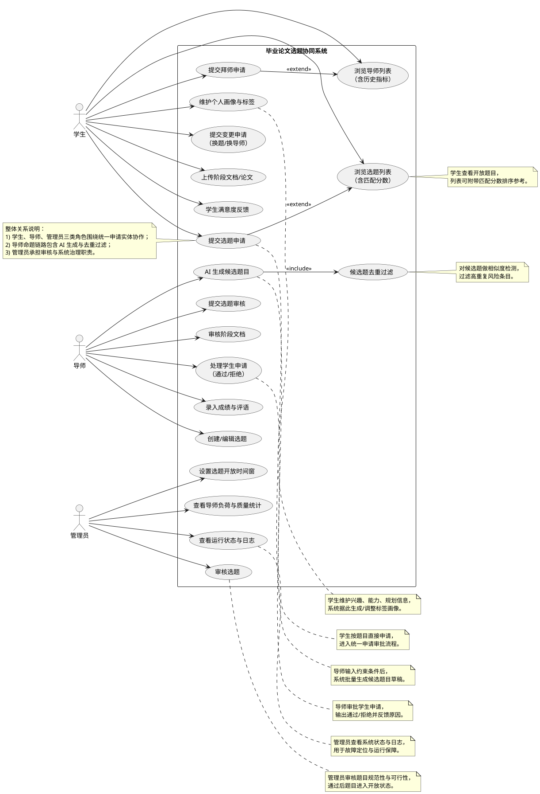
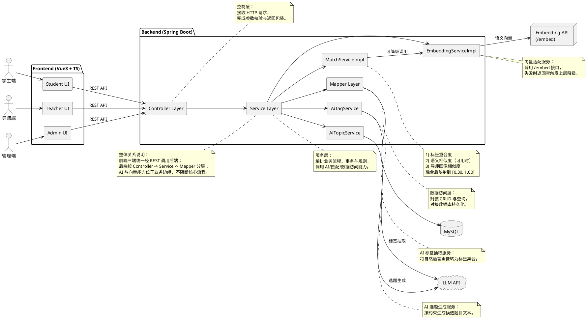
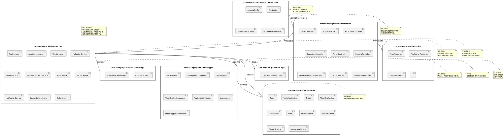

# 论文 UML 图代码（PlantUML）

说明：本文件提供可直接转换的 UML 代码，覆盖用例图、系统设计架构图、类图、包图。  
使用方式：将任一代码块复制到 PlantUML 渲染器（本地插件/在线工具）即可出图。

---

## 1）系统角色用例图（Use Case）



---

## 2）系统设计架构图（Architecture / Component）



---

## 3）功能模块类图（Class Diagram）

```plantuml
@startuml
skinparam classAttributeIconSize 0

class TopicController {
  +getOpenTopicsWithScore() : 获取开放选题并计算匹配分
  +generateAiTopics() : 生成AI候选题目
  +submitForReview() : 提交选题进入审核流程
}

class ApplicationController {
  +submitApplication() : 学生提交选题申请
  +processApplication() : 导师处理申请结果
}

class EvaluationController {
  +saveEvaluation() : 导师录入成绩与评语
  +saveStudentFeedback() : 学生提交满意度反馈
}

class TopicService {
  +createTopic() : 创建选题
  +updateTopic() : 更新选题
  +checkDuplicate() : 执行选题去重检测
  +submitForReview() : 提交选题审核
}

class ApplicationService {
  +submitApplication() : 提交申请并写入事务
  +processApplication() : 审批申请并更新状态
  +calculateMatchScore() : 计算申请匹配分
}

class EvaluationService {
  +saveEvaluation() : 保存导师评价
  +saveStudentFeedback() : 保存学生反馈
  +recalcTopicMetricsForTeacher() : 重算导师名下选题指标
}

class MatchServiceImpl {
  +calculateMatchScore(topic, studentId) : 计算融合匹配分
  -calculateOverlapScore() : 计算标签重合度
  -calculateSemanticSimilarity() : 计算语义相似度
  -calculateTeacherStudentSimilarity() : 计算师生画像相似度
}

class EmbeddingServiceImpl {
  +embedText(text) : 获取文本向量
  -normalizeText(text) : 文本归一化处理
}

class AiTagService {
  +extractTagNames(text) : 抽取标签关键词
}

class AiTopicService {
  +generateTopicsForTeacher() : 生成导师候选选题
  -parseAiTopics() : 解析大模型返回结果
}

class DuplicateCheckAlgorithm {
  +calculateSimilarity(text1, text2) : 计算文本相似度
  +isPassed(similarity) : 判断是否通过去重阈值
}

class Topic {
  +id: Long
  +teacherId: Long
  +title: String
  +description: String
  +status: TopicStatus
}

class TopicApplication {
  +id: Long
  +topicId: Long
  +studentId: Long
  +status: ApplicationStatus
  +matchScore: BigDecimal
}

class Thesis {
  +id: Long
  +topicId: Long
  +studentId: Long
  +status: ThesisStatus
}

class ThesisEvaluation {
  +id: Long
  +thesisId: Long
  +teacherId: Long
  +score: BigDecimal
  +studentScore: BigDecimal
}

class TopicMetrics {
  +topicId: Long
  +avgScore: BigDecimal
  +excellentRatio: BigDecimal
  +failRatio: BigDecimal
}

note right of TopicController
控制层：
负责接收前端请求、
参数校验与响应返回。
end note

note right of TopicService
业务层（选题）：
负责选题创建、更新、
去重检测与提审流程。
end note

note right of ApplicationService
业务层（申请）：
负责申请提交/处理、
匹配分数计算调用与
事务一致性控制。
end note

note right of MatchServiceImpl
匹配核心：
标签重合度 + 语义相似度 +
导师画像相似度融合。
end note

note right of EmbeddingServiceImpl
向量服务适配层：
调用 /embed 接口；
失败时返回 null，
由上层走降级逻辑。
end note

note right of DuplicateCheckAlgorithm
去重算法层：
Jaccard 与余弦相似度融合，
用于题目重复风险判定。
end note

note right of TopicApplication
申请关系锚点：
关联学生、导师与选题，
承载匹配分数与状态。
end note

note right of ThesisEvaluation
评价闭环实体：
保存导师评分与学生反馈，
支撑质量统计与复盘。
end note

TopicController --> TopicService
TopicController --> AiTopicService
TopicController --> ApplicationService

ApplicationController --> ApplicationService
EvaluationController --> EvaluationService

TopicService --> DuplicateCheckAlgorithm
ApplicationService --> MatchServiceImpl
EvaluationService --> TopicMetrics

MatchServiceImpl --> EmbeddingServiceImpl
AiTagService --> MatchServiceImpl : <<辅助标签建模>>
AiTopicService --> DuplicateCheckAlgorithm : <<去重依赖>>

ApplicationService --> TopicApplication
TopicService --> Topic
EvaluationService --> Thesis
EvaluationService --> ThesisEvaluation

note "依赖关系说明：\nController -> Service -> Entity/Algorithm。\n其中 MatchServiceImpl 依赖 EmbeddingServiceImpl，\n在向量不可用场景下可降级回标签匹配。" as N1
N1 .. MatchServiceImpl
@enduml
```



---

## 4）包图（Package Diagram）



---

## 5）可选：选题申请时序图（Sequence Diagram）

```plantuml
@startuml
actor 学生 as Student
participant "ApplicationController" as AC
participant "ApplicationService" as AS
participant "MatchServiceImpl" as MS
participant "EmbeddingServiceImpl" as ES
participant "TopicApplicationMapper" as APM
participant "TopicMapper" as TM
participant "NotificationService" as NS

Student -> AC : 提交选题申请(topicId, remark)
AC -> TM : 查询 Topic
AC -> AS : submitApplication(topicId, studentId, remark, matchScore)
AS -> MS : calculateMatchScore(topic, studentId)
MS -> ES : embedText(studentText/topicText)
alt embedding 服务可用
  ES --> MS : vector
else embedding 服务不可用/超时
  ES --> MS : null（回退）
end
MS --> AS : matchScore
AS -> APM : insert(topic_application)
AS -> TM : update current_applicants
AS -> NS : createNotification(teacherId,...)
AS --> AC : application
AC --> Student : 返回申请结果

note right of AC
控制器职责：
接收申请请求并调用服务层。
end note

note right of AS
服务职责：
完成事务写入（申请记录 + 名额更新）
并触发通知。
end note

note right of MS
匹配职责：
融合标签与语义分数，
输出最终匹配结果。
end note

note right of ES
向量职责：
提供 embedding；
不可用时返回空以便降级。
end note

note "整体关系说明：\n该时序展示了“提交申请”主链路；\n向量调用存在可用/不可用分支；\n无论分支如何，主流程都可完成申请入库。" as SEQ_ALL
SEQ_ALL .. AS
@enduml
```

